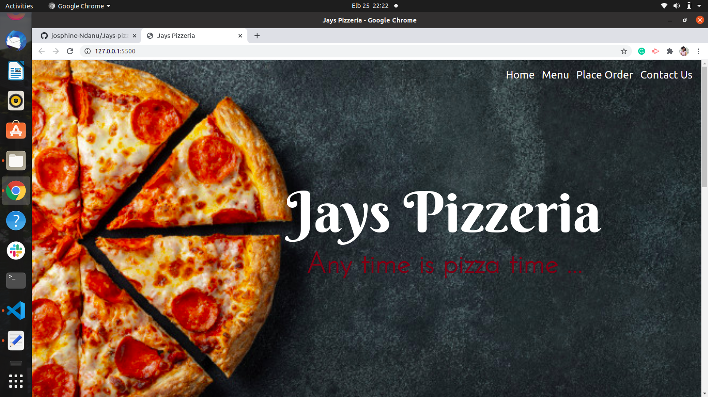

# JAYS PIZZERIA

## Author
Josphine Ndanu, josphinendanu3@gmail.com

## Description
This is a Pizza ordering site 

### Prerequisites
You should have git installed.
Use the following command for installation.
`$ sudo apt install git-all`

### Setup
To access this project on your local files, you can clone it using these steps

Open your terminal
lone using this command `$ git clone https://github.com/josphine-Ndanu/Jays-pizzeria
This will clone the repository into your local folder

### Technologies Used
 1. HTML
 2. CSS
 3. js
 4. jQuery
 5. bootsrap 5
 6. Git

### Live Site
View [live](https://josphine-ndanu.github.io/Jays-pizzeria)

### Licence
This project is under the  [MIT](LICENSE) licence
